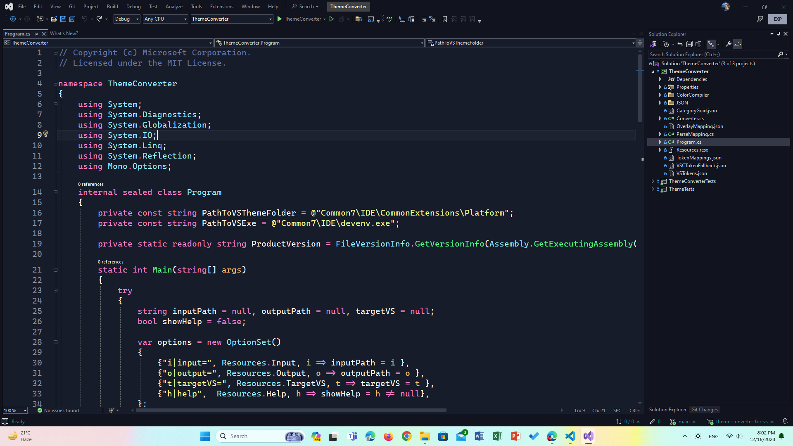
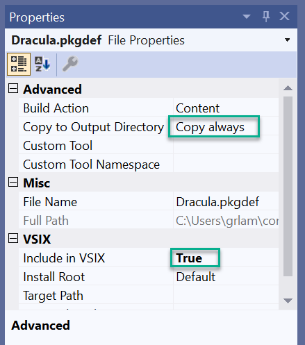

# Learn with Sumit Theme for Visual Studio (Unofficial)

If you love the [Learn with Sumit Theme for VS Code](https://marketplace.visualstudio.com/items?itemName=SumitSaha.learn-with-sumit-theme) you can now enjoy the same themes in Visual Studio that make coding fun and easy.

## Screenshot



## Contributing

### Adding new variant

1. Download and compile [Theme Converter](https://github.com/microsoft/theme-converter-for-vs)
1. Create an `.env` file and add `THEME_CONVERTER_PATH` in the file.

    ```ini
    THEME_CONVERTER_PATH="H:\theme-converter-for-vs\ThemeConverter\ThemeConverter\bin\Debug\net6.0\"
    ```

1. Get and store theme from VS Code

    1. Open VS Code.
    1. Install the desired color theme and switch to this theme in VS Code. Please note that this tool will not convert icon themes.
    1. “Ctrl + Shift + P” and run “Developer: Generate Color Theme from current settings.”
    1. In the generated JSON, uncomment all code. When you uncomment, please be careful about missing commas! Make sure the JSON is valid.
    1. Save this as a “JSON” file in `vscode-themes` folder for the conversion, using the theme's name as the file name. Please ensure that the file’s extension is .json. (The file shouldn’t be saved as a JSONC file.)

1. Run converter script

    You need `node` >= 21 to run the script.

    ```shell
    npm run build
    ```

1. Open `".\Learn With Sumit Theme (Unofficial)\Learn With Sumit Theme (Unofficial).sln"` file.

1. Select the project node and open the "Add existing Item" window: Use "Shift + Alt + A" or right-click on the project node, select Add > Existing Item.

   Set filter to All Files (.) and select the converted .pkgdef file(s) that you want to
   include in this VSIX.

1. Right click on newly added `.pkgdef` file and go to properties and set the properties like below:

      

1. Open the source.extension.vsixmanifest file, then select Assets, select New.
1. Set Type to Microsoft.VisualStudio.VsPackage, and Source to File on filesystem.
1. Select Browse and select the .pkgdef you added. Select OK.
1. Edit other fields in the vsixmanifest as desired (author, version, company, etc).
Build solution and you now have a vsix in the output folder! Your new theme is most compatible with Visual Studio 2022.
